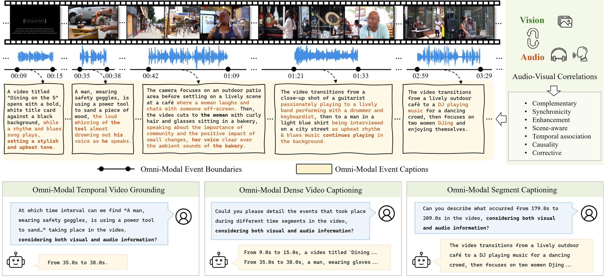

<h2 align="center"> <a href="https://arxiv.org/abs/2411.19772">LongVALE: Vision-Audio-Language-Event Benchmark Towards Time-Aware Omni-Modal Perception of Long Videos</a></h2>

<h4 align="center"> Tiantian Geng, Jinrui Zhang, Qingni Wang, Teng Wang, Jinming Duan, Feng Zheng </h3>

<h5 align="center"> If our project helps you, please give us a star ⭐ and cite our <a href="#Citation">paper</a>!</h2>
<!-- # LongVALE -->

<!-- [](https://arxiv.org/abs/2411.19772) -->

[[🌐 Project Page]()] [[📖 arXiv Paper](https://arxiv.org/abs/2411.19772)] [[📊 LongVALE Dataset](https://huggingface.co/datasets/ttgeng233/LongVALE)]

## News

<!-- - 28/02/2025, 🔥The LongVALE dataset is released. -->
- 27/02/2025, 🔥LongVALE has been accepted to CVPR 2025.

TODO

- [x] Release the annotation files of LongVALE.
- [ ] Release the extracted features (video, audio, speech) of LongVALE.
- [ ] Release the LongVALE-LLM model with training and evauluation code.
- [ ] Release raw videos of LongVALE.
  
## 👀 Overview
<!-- Recent advancements in video understanding remain limited to coarse-grained and visual-only tasks. However, real-world videos encompass omnimodal information (vision, audio, and speech) with a series of events forming a cohesive storyline. The lack of
multi-modal video data with fine-grained event annotations
and the high cost of manual labeling are major obstacles
to comprehensive omni-modality video perception. To address this gap,  -->
- We propose an automatic pipeline consisting of high-quality multi-modal video filtering, semantically coherent omni-modal event boundary detection, and crossmodal correlation-aware event captioning. 
- We present LongVALE, the first-ever Vision-Audio-Language
Event understanding benchmark comprising 105K omnimodal events with precise temporal boundaries and detailed relation-aware captions within 8.4K high-quality long videos. 
- We build LongVALE-LLM to enable video large language models (LLMs) for omni-modality fine-grained temporal video understanding for the first time. 
<div align="center">
    
    <br/>
    <figcaption></figcaption>
</div>

## Dataset 
### Annotation files of training and evaluation sets
| Split           | Download | # Videos | # Omni-modal Events | Video Duration |
|-----------------|----------|-----------------|-----------|----------------|
|Training set | [🤗 link](https://huggingface.co/datasets/ttgeng233/LongVALE/resolve/main/longvale-annotations-training.json)| 7,240 | 91,863 | 473.8 hrs |
|Evaluation set | [🤗 link](https://huggingface.co/datasets/ttgeng233/LongVALE/resolve/main/longvale-annotations-eval.json)| 1,171 |13,867 | 75.6 hrs |


**[Note]** The json files include the information of video id (YouTube id), video duration, timestamps and detailed captions of each omni-modal events. You can download the raw videos on YouTube using the provided video ids.

### LongVALE-based dialogue data for LongVALE-LLM training 
| Tuning Stage          | Download | # Videos | # QA Dialogues | Data Source |
|-----------------|----------|-----------------|-----------|---|
|Omni boundary perception | [🤗 longvale-sft-bp-7k](https://huggingface.co/datasets/ttgeng233/LongVALE/resolve/main/longvale-sft-bp-7k.json) | 7,240 | 7,240 |LongVALE |
|          | [🤗 longvale-sft-bp-154k](https://huggingface.co/datasets/ttgeng233/LongVALE/resolve/main/longvale-sft-bp-154k.json) | ~141K | ~154K | LongVALE + [VTimeLLM_stage2](https://github.com/huangb23/VTimeLLM)  |
|Omni instruction tuning |[🤗 longvale-sft-it-25k](https://huggingface.co/datasets/ttgeng233/LongVALE/resolve/main/longvale-sft-it-25k.json) | 7,240 | ~25.4K | LongVALE | 
| | [🤗 longvale-sft-it-61k](https://huggingface.co/datasets/ttgeng233/LongVALE/resolve/main/longvale-sft-it-61k.json)| - |~61.4K|LongVALE + [VTimeLLM_stage3](https://github.com/huangb23/VTimeLLM) |


## Acknowledgement
We are grateful for the following awesome projects: [VTimeLLM](https://github.com/huangb23/VTimeLLM)
  

## Citation
If you find our project are useful for your research, please consider citing:
```
@article{geng2024longvale,
  title={Longvale: Vision-audio-language-event benchmark towards time-aware omni-modal perception of long videos},
  author={Geng, Tiantian and Zhang, Jinrui and Wang, Qingni and Wang, Teng and Duan, Jinming and Zheng, Feng},
  journal={arXiv preprint arXiv:2411.19772},
  year={2024}
}
```
